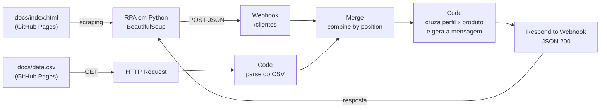

# Assistente de Investimentos com RPA e IA Generativa

Solução para o desafio **"Criando um Processo de RPA com N8N e Python"** da [DIO](https://web.dio.me) — trilha *Santander | Automação com n8n*.

O enunciado original está preservado em [`README-desafio-original.md`](README-desafio-original.md).

---

## O que foi construído

Um pipeline que sai de uma página web e chega em mensagens de recomendação personalizadas, sem intervenção humana:



| Entregável | Onde está |
|---|---|
| Workflow n8n com mensagens estáticas (MVP) | [`n8n/workflow.json`](n8n/workflow.json) |
| Workflow n8n com Agente de IA (desafio extra) | [`n8n/workflow-ia.json`](n8n/workflow-ia.json) |
| Script de RPA integrado ao webhook | [`rpa/extrair_clientes.ipynb`](rpa/extrair_clientes.ipynb) |
| Página de clientes e catálogo de produtos | [`docs/`](docs/) |
| Evidência de execução | [`evidencias/`](evidencias/) |

---

## Como executar

### 1. Importar o workflow no n8n

1. No n8n (Cloud ou local): **Workflows → Import from File** → selecione `n8n/workflow.json`.
2. Abra o nó **Webhook** e copie a URL gerada.
   - *Test URL* (`.../webhook-test/clientes`) só responde com **Listen for test event** ligado.
   - *Production URL* (`.../webhook/clientes`) exige o workflow **Active**.
3. Nenhuma credencial é necessária para o MVP.

### 2. Rodar o RPA no Google Colab

1. Abra `rpa/extrair_clientes.ipynb` no [Google Colab](https://colab.research.google.com/).
2. Execute a célula de dependências (`requests`, `beautifulsoup4`).
3. Na célula de envio, substitua o valor de `N8N_WEBHOOK` pela URL copiada acima.
4. Execute. O notebook imprime os clientes extraídos e, em seguida, as recomendações devolvidas pelo n8n.

### 3. Versão com IA generativa (opcional)

Importe `n8n/workflow-ia.json`, abra o nó **Google Gemini Chat Model** e selecione uma credencial *Google Gemini (PaLM) API*. O restante do fluxo é idêntico.

---

## Documentação das decisões técnicas

### Por que o CSV é lido dentro do n8n, e não no Python

O RPA tem uma responsabilidade só: extrair os clientes da página. O catálogo de produtos é regra de negócio e muda com frequência — deixá-lo no n8n permite trocar o `data.csv` sem tocar no notebook, e mantém o robô substituível (qualquer origem de clientes serve, desde que envie o mesmo JSON).

### Por que `Merge` em modo *combine by position*

O webhook entrega **1 item** (o array de clientes) e o parser do CSV entrega **1 item** (o array de investimentos). Combinar por posição junta esses dois itens em um só, que segue para o nó de mensagens. Combinar por chave não faria sentido aqui, porque não existe campo comum entre as duas fontes — o cruzamento real (`perfil`) acontece um passo depois, em JavaScript.

### Como o produto é escolhido

Para cada cliente:

1. filtra os produtos do mesmo `perfil`;
2. mantém só os que o saldo do cliente já alcança (`saldo >= minimo`);
3. entre os elegíveis, escolhe o de maior aplicação mínima — a opção mais "completa" que o cliente consegue acessar hoje.

Se nenhum produto for elegível, o cliente ainda recebe uma mensagem (com o produto de entrada do perfil e um campo `alerta`), em vez de sumir da resposta. Falhar silenciosamente é o pior resultado possível num fluxo de comunicação com cliente.

### Tratamento dos dados

- `saldo` chega como texto brasileiro (`"R$ 12.500,00"`) e é convertido para número antes de qualquer comparação;
- `minimo` chega como texto no CSV e também é normalizado;
- o CSV é parseado manualmente (`split`) em vez de usar o nó *Extract From File*, para o workflow importar e rodar sem depender de nenhum nó extra ou binário intermediário.

### `Respond to Webhook` em vez de resposta imediata

O nó **Webhook** está configurado com `responseMode: responseNode`. Assim o Python não recebe só um "recebi": ele recebe o resultado processado (`ok`, `total_clientes`, `total_investimentos`, `recomendacoes`), o que torna o notebook um cliente de verdade do fluxo e facilita muito a depuração ponta a ponta.

### MVP e IA em arquivos separados

`workflow.json` roda com zero credenciais — qualquer pessoa importa e executa. `workflow-ia.json` troca o gerador de mensagens por um **Basic LLM Chain** com **Google Gemini**, montando um prompt por cliente com perfil, saldo e o catálogo daquele perfil. O prompt proíbe explicitamente inventar produtos fora do catálogo e prometer retorno garantido — a IA reescreve a mensagem, não decide o investimento. Manter os dois arquivos separados deixa claro o que é MVP e o que é extra, e evita que o fluxo principal quebre para quem não tem chave de API.

---

## Estrutura do repositório

```
├── README.md                       # esta documentação
├── README-desafio-original.md      # enunciado original da DIO
├── docs/
│   ├── index.html                  # página de clientes (GitHub Pages)
│   └── data.csv                    # catálogo de investimentos por perfil
├── rpa/
│   └── extrair_clientes.ipynb      # RPA em Python + envio ao webhook
├── n8n/
│   ├── workflow.json               # MVP: mensagens estáticas
│   └── workflow-ia.json            # desafio: mensagens via LLM
└── evidencias/                     # prints do fluxo em execução
```

---

## Stack

Python 3 · requests · BeautifulSoup · Google Colab · n8n · GitHub Pages · Google Gemini
